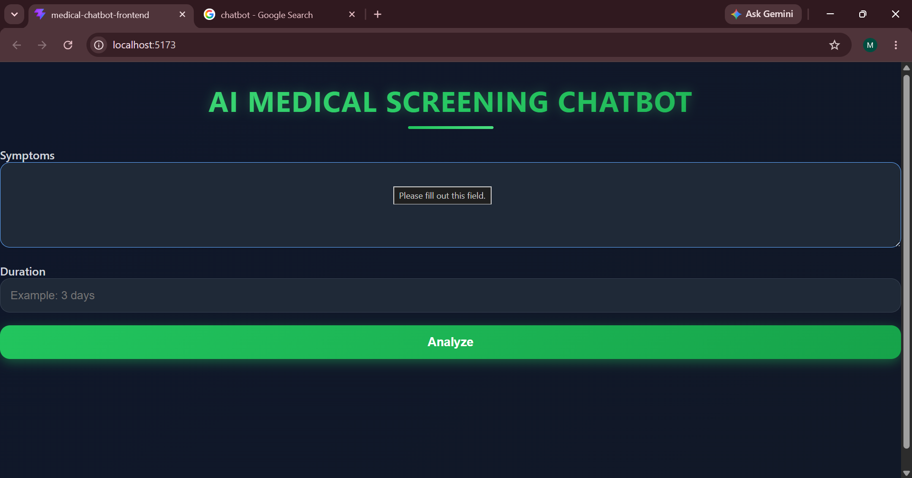
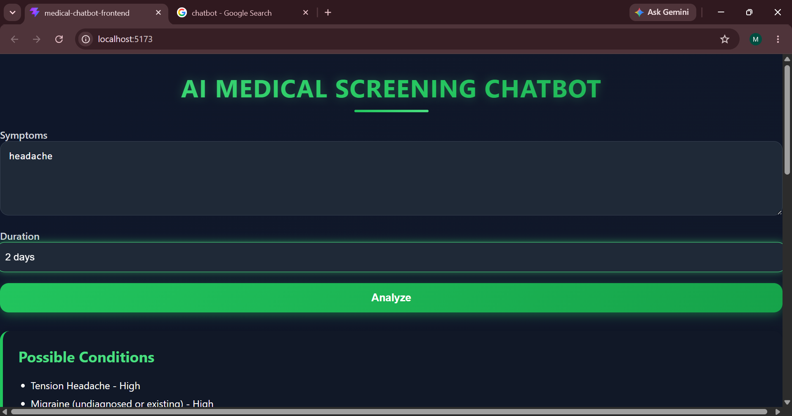
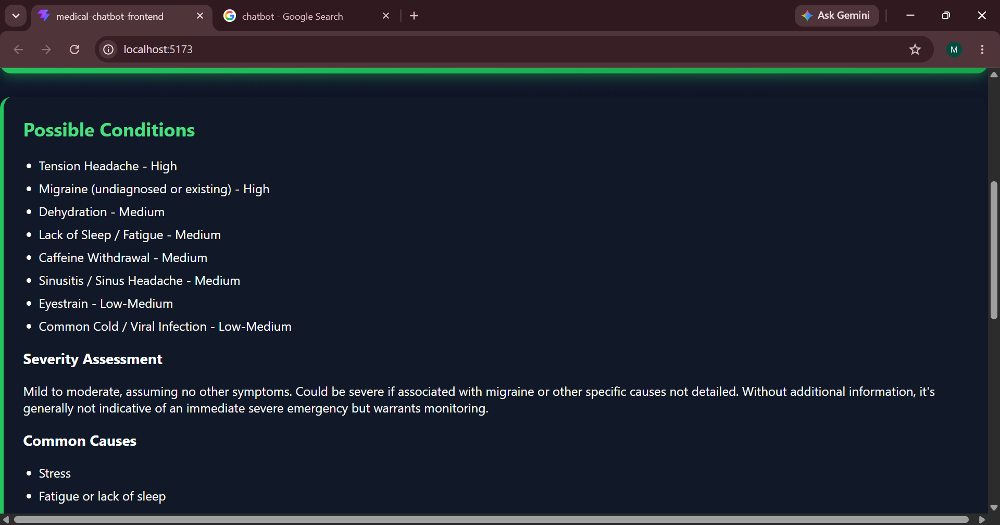
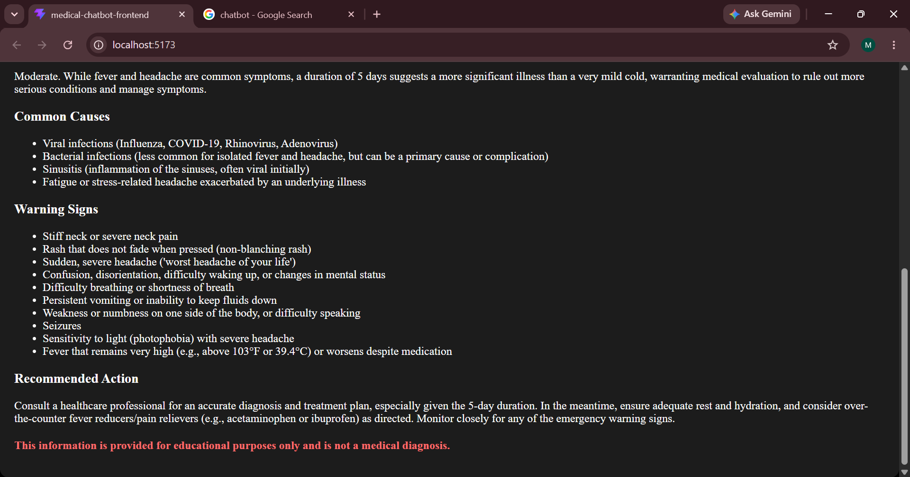

# Medical-Screening-Chatbot
AI-powered medical screening chatbot built with React, Django REST Framework, and Google Gemini API.
# AI Medical Screening Chatbot

## Technologies Used
- React (Vite)
- Django REST Framework
- Google Gemini API

## Features
- Enter symptoms and duration
- AI-generated medical screening
- Severity assessment
- Warning signs
- Educational disclaimer

<<<<<<< HEAD
=======
## Screenshots

>>>>>>> f1f5f1f63fe5acc4382d77fe25629159fc097018

## Demo Video
[Watch Demo](Screen Recording 2026-06-26 114044.mp4)
